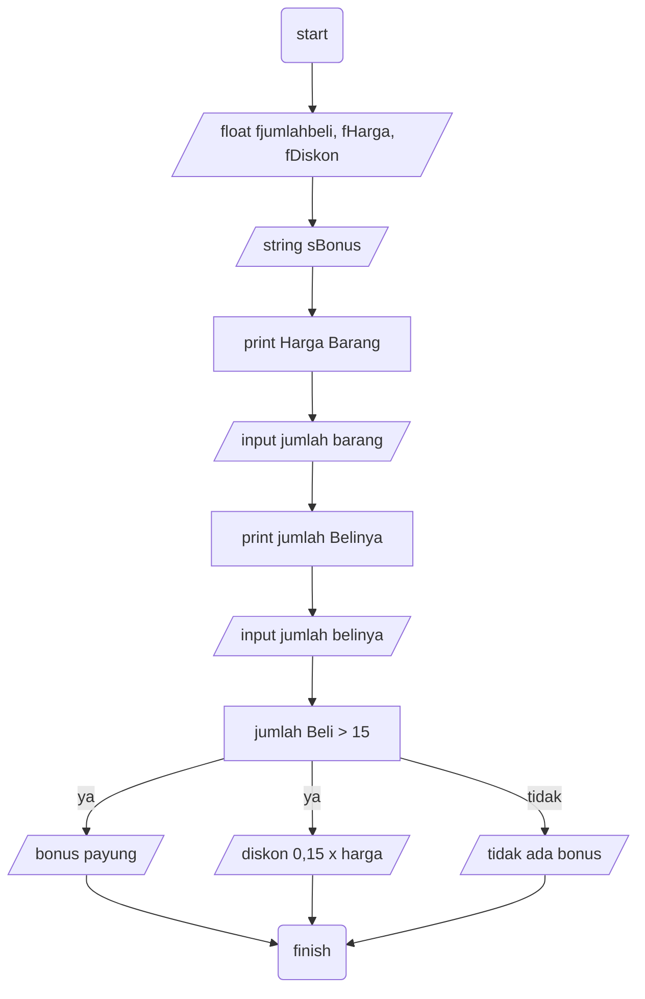

```mermaid
    flowchart TD;
    A(start) --> B[/float fjumlahbeli, fHarga,  fDiskon/];
    B --> C[/string sBonus/];
    C --> D[print Harga Barang];
    D --> E[/input jumlah barang/];
    E --> F[print jumlah Belinya];
    F --> G[/input jumlah belinya/];
    G --> H[jumlah Beli > 15];
    H --ya--> I[/bonus payung/];
    H --ya--> J[/diskon 0,15 x harga/];
    H --tidak--> K[/tidak ada bonus/];
    I --> 0(finish)
    J --> 0
    K --> 0
```

